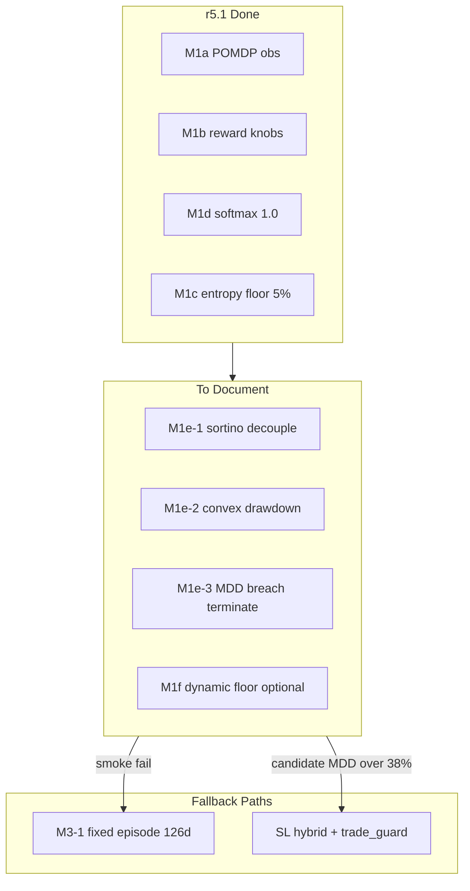

# r5 MDD 修復計畫文件化

## 背景

[`new file`](new file) 是一份針對 r5.1 落地後仍存在的 reward/MDP 缺陷分析。程式碼審核確認三個問題**仍存在**於 [`trading_env.py`](trading_env.py)：

| 問題 | 現況（行號） | 影響 |
|------|-------------|------|
| sortino × capital_util 反向激勵 | L397–402：`sortino_component = sortino_proxy * capital_util` | 減倉控 MDD 時 sortino 分量下降，與 `LAMBDA_DRAWDOWN` / `cash_defensive_bonus` 方向衝突 |
| 線性 drawdown penalty vs 端點 Gate | L429–430：`drawdown_p = LAMBDA_DRAWDOWN * max(0, raw_dd - REWARD_REF_DD)` | 日流量懲罰無法對齊 OOS `max_drawdown` 峰值（Gate 35%） |
| entropy floor 壓縮 cash 空間 | L289–291：`MIN_TOP_K_WEIGHT=0.05` × topk=5 → 股票最低 25% | 深度回撤時無法「幾乎全現金」，與 `cash_defensive_bonus` 矛盾 |

r5.1 已完成的改動（M1a/M1b/M1d/M1c）在草稿中已肯定；quick 30K 方向性通過（[`.research/runs/m2-smoke-quick-metrics.json`](.research/runs/m2-smoke-quick-metrics.json)，2025H1 MDD 31.9%），但 R6 reference worst MDD 仍為 44.41%（[`.research/research_state.json`](.research/research_state.json) `gate.r4_baseline_worst_mdd`）。



---

## 交付物

### 1. 新建決策文件 [`.research/decisions/r5-mdd-remediation.md`](.research/decisions/r5-mdd-remediation.md)

將 `new file` 全文結構化遷移，並補充程式錨點與 v3 紀律。建議章節：

1. **摘要** — r5.1 已做對什麼、為何仍可能 Gate fail
2. **問題 1（高）** — sortino × capital_util  
   - 現況引用：`trading_env.py` L397–412  
   - 建議修法 A：`sortino_component = sortino_proxy`  
   - 備選 B：`sortino_proxy * max(capital_util, 0.3)`
3. **問題 2（高）** — 線性 penalty vs 端點 MDD  
   - 現況引用：L429–430、`_max_drawdown` 更新於 L361–362  
   - 對策 2a：凸形 penalty（草稿公式，knee 0.25–0.28）  
   - 對策 2b：`_max_drawdown > 0.38` 時 `terminated=True`, `reward=-1.0`（在 `step()` L161–177 後段插入）
4. **問題 3（中）** — entropy floor vs cash-defensive  
   - 現況引用：L289–291、`MIN_TOP_K_WEIGHT` L23  
   - 建議：drawdown 掛鉤 floor（`raw_dd >= 0.15` → floor 0.01）或全局降至 0.02
5. **三條路徑** — A（M1e 微調）/ B（M3-1 episode）/ C（SL hybrid + trade_guard）  
   - 附預期效果與觸發條件（對齊 [`docs/RESEARCH_STRATEGY_V3.md`](docs/RESEARCH_STRATEGY_V3.md) §6）
6. **實作規格（M1e 子項）** — 每項含：改動檔案、常數、`ENV_CONFIG_VERSION` bump、測試、驗收  
   - **執行順序：TBD**（依你選擇，此階段不寫死 M2-smoke 前後）
7. **單變因紀律** — 引用 cp-research-loop skill：一次只上一個 M1e 假設；每輪 bump `ENV_CONFIG_VERSION`（r5.2 / r5.3 / …）

### 2. 更新 [`.research/decisions/README.md`](.research/decisions/README.md)

新增一行索引：

```markdown
| r5-mdd-remediation.md | r5.1 後 MDD 對齊修復（M1e 規格；執行順序 TBD） |
```

### 3. 更新 [`.research/research_state.json`](.research/research_state.json)

在 `queue` 中 `M1c`（done）與 `M2-smoke`（pending）之間插入四項，**全部 `status: "pending"`**，`blocked_by` 串接：

| ID | title | note |
|----|-------|------|
| **M1e-1** | sortino decouple capital_util | `ENV_CONFIG_VERSION` → r5.2；decision: `.research/decisions/r5-mdd-remediation.md` §2 |
| **M1e-2** | convex drawdown penalty | r5.3；blocked_by M1e-1 |
| **M1e-3** | MDD breach episode termination | r5.4；threshold 0.38；blocked_by M1e-2 |
| **M1f** | dynamic entropy floor optional | 中優先；blocked_by M1e-3；僅 smoke 仍 cash-starved 時啟用 |

更新 `strategy_note` 提及決策文件已落地、M1e 執行順序與 M2-smoke 時機 **TBD**。

`M2-smoke` 的 `blocked_by` 暫**不**改（維持 `[]`），避免在未決定時機前鎖死 queue。

### 4. 輕量更新 [`docs/RESEARCH_STRATEGY_V3.md`](docs/RESEARCH_STRATEGY_V3.md)

- §3「r5 重構範圍」末尾加一小節 **「M1e — r5.1 後 MDD 對齊」**，連結決策文件
- §5 Queue 表加 M1e-1/2/3/f 行（status: pending）
- §8 修訂紀錄加一筆：`2026-06-11 · v3.4：M1e MDD remediation 決策文件`

### 5. 刪除草稿 [`new file`](new file)

內容遷移完成並交叉引用無誤後刪除根目錄 `new file`（untracked，不影響 git history）。

---

## 未來實作時的程式變更預覽（本階段不做）

供 M1e 執行時參考，已寫入決策文件即可：

**M1e-1** — [`trading_env.py`](trading_env.py) `_compute_reward` L402  
**M1e-2** — 同函式 L429–430；可抽常數 `CONVEX_DD_KNEE`  
**M1e-3** — `step()` L161–177；常數 `MDD_BREACH_THRESHOLD = 0.38`  
**M1f** — `_transform_action` L289–291  

配套測試（實作階段再寫）：

- 新建 [`tests/test_m1e_reward_remediation.py`](tests/test_m1e_reward_remediation.py)  
  - sortino 在減倉後不應因 `capital_util` 單獨下降  
  - 高 `raw_dd` 時凸形 penalty > 線性  
  - `_max_drawdown > 0.38` 觸發 terminated + reward override  
- 更新 [`tests/test_m1b_reward_r5.py`](tests/test_m1b_reward_r5.py) 的 `ENV_CONFIG_VERSION` 斷言（隨 bump 調整）  
- 更新 [`env_config.py`](env_config.py) snapshot 若新增常數需納入 hash

驗收腳本（執行順序決定後）：

```powershell
.\env\Scripts\python.exe -m pytest tests/test_m1e_reward_remediation.py -q
# quick smoke per M1e round（30K）或 full M2-smoke（300K）— 時機 TBD
```

---

## 不做的事（本階段）

- 不修改 [`trading_env.py`](trading_env.py) 或任何測試
- 不跑 walk_forward / experiment_report
- 不決定 M1e 與 M2-smoke 300K 的先後順序
- 不建立 git commit（除非你另行要求）
