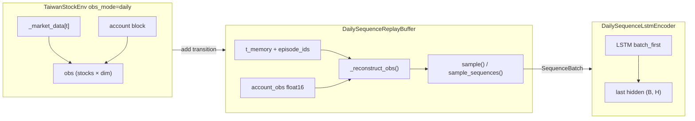

> Superseded by 2026-06-14 SL-first strategy.
> This document is retained as historical context only. It must not be treated as an active implementation queue unless explicitly updated after 2026-06-14.
# SAC-R Plan Review Brief — R-S0 / R-S1 / R-S2

> **SUPERSEDED**（2026-06-11）：SAC-R 研究線已 **frozen**。活躍審核改為 `V3-STRATEGY-REVIEW-BRIEF.md` (`V3-STRATEGY-REVIEW-BRIEF.md`)。本文件僅作歷史參考。

> **Audience**: Review agent（完整計劃審核）
> **Handoff**: `.research/handoffs/SAC-R.json` (`../handoffs/SAC-R.json`)
> **Date**: 2026-06-11
> **Worktree**: `C:\Users\ggini\Desktop\cp-sac-r` · branch `feat/sac-r-recurrent`

---

## 0. 審核任務

請對 **Line B SAC-R（Recurrent SAC）** 做完整計劃審核，涵蓋：

1. 戰略定位（與 Line A / R6 脫鉤是否合理）
2. R-S0 → R-S1 → R-S2 實作是否滿足 acceptance
3. R-S2b / R-S3 roadmap 風險與優先序
4. 是否建議 **GO / GO with nits / BLOCK** 進入 R-S2b

**Verdict 格式**（寫入 `.research/reviews/SAC-R-reviewed-by-<agent>.md`）：

```text
verdict: pass | pass_with_nits | needs_changes | block
blockers: [...]
nits: [...]
r_s2b_recommendation: ...
```

---

## 1. 必讀文件（依序）

| # | 路徑 | 目的 |
|---|------|------|
| 1 | `docs/SAC_BUFFER_PLAN.md` §4 | SAC-R 路線、否決條件、工作區規則 |
| 2 | `.research/decisions/sac-r-spike.md` | R-S0 決策與 fps 解讀 |
| 3 | `.research/research_state.json` | queue / gate / research_lines |
| 4 | `.research/handoffs/SAC-R.json` | 本 handoff 機讀摘要 |
| 5 | `cp-sac-r/trading_env.py` | `obs_mode="window"|"daily"` |
| 6 | `cp-sac-r/sac_r/daily_sequence_buffer.py` | R-S2 核心 |
| 7 | `cp-sac-r/sac_r/lstm_encoder.py` | LSTM encoder stub |
| 8 | `cp-sac-r/tests/test_obs_mode_daily.py` | R-S1 reward 一致性 |
| 9 | `cp-sac-r/tests/test_daily_sequence_buffer.py` | R-S2 單元測試 |
| 10 | `results_dir/sac_r_spike.json` | R-S0 metrics |
| 11 | `results_dir/sac_r_rs2_smoke.json` | R-S2 smoke |

---

## 2. 研究線背景（30 秒）

```text
Line A (main)     GNN + window obs (~96K) + IndexedReplayBuffer  — 工程維護
Line B (cp-sac-r) daily obs (~數百維) + LSTM + SequenceBuffer     — 新 MDP，不可比 R6
```

- **R6 / Promotion Gate**：僅擋 live；**不是** SAC-R merge 條件
- **禁止**：在 main `train_portfolio.build_model` 混入 recurrent 預設
- **允許**：worktree 獨立 `sac_r/train.py`（R-S2b 起）

---

## 3. 階段驗收清單

### R-S0 ✅ Spike

| 檢查 | 預期 |
|------|------|
| RecurrentPPO smoke | Windows + CUDA 可跑 |
| Decision memo | `.research/decisions/sac-r-spike.md` verdict PASS |
| 結論 | 必須 daily obs，不可 flatten 96K window |

### R-S1 ✅ `obs_mode="daily"`

| 檢查 | 預期 |
|------|------|
| Env 契約 | `market_block = _market_data[t]`；obs dim = F + account (+SL) |
| Reward 一致 | 同 seed + actions，window vs daily **identical** portfolio/reward/termination |
| Tests | `tests/test_obs_mode_daily.py` 8 passed |

### R-S2 ✅ Sequence buffer + encoder smoke（**本 handoff 重點**）

| 檢查 | 預期 | 驗證命令 |
|------|------|----------|
| Buffer 僅 daily | `ValueError` if window | pytest `test_daily_sequence_buffer_requires_daily_mode` |
| SB3 `sample()` | `ReplayBufferSamples` 可用 | pytest + smoke `sb3_single_sample_ok` |
| `sample_sequences` | shape `(B,L,stocks,dim)`；不跨 episode done | pytest |
| LSTM forward | `(B,L,D) → (B, hidden)` | pytest + smoke `lstm_forward_ok` |
| RecurrentPPO proxy | daily flat obs 可 learn | smoke `recurrent_ppo.fps` |
| Line A 隔離 | main `train_portfolio.py` 未改 | git diff main |

**R-S2 刻意未做**（留 R-S2b）：

- Custom `LstmSacPolicy` / SAC.train 改寫
- Hidden state `(h,c)` 存入 buffer
- Burn-in / truncated BPTT 策略
- WF 基線

---

## 4. 重現命令

```powershell
cd C:\Users\ggini\Desktop\cp-sac-r

# R-S1 + R-S2 單元測試
..\cp\env\Scripts\python.exe -m pytest tests/test_obs_mode_daily.py tests/test_daily_sequence_buffer.py -q

# R-S2 smoke → cp/results_dir/sac_r_rs2_smoke.json
..\cp\env\Scripts\python.exe scripts/sac_r_rs2_smoke.py

# 可選：R-S0 spike
..\cp\env\Scripts\python.exe scripts/sac_r_spike.py
```

---

## 5. 架構圖（R-S2 現狀）



---

## 6. 審核重點問題

請逐項給出 **pass / concern / block** 與理由：

### 6.1 正確性

- [ ] `_reconstruct_obs` 與 env `obs_mode=daily` step 輸出 bitwise 一致（除 float16 誤差）
- [ ] `optimize_memory_usage=True` 時 next_obs 與 `(pos+1)` 邏輯正確
- [ ] `sample_sequences` episode 邊界：`dones[:-1]` 檢查是否充分？wrap-around buffer 環形邊界？
- [ ] `episode_ids` 在 `done` 時遞增 — 多 env 是否正確

### 6.2 效能

- [ ] Smoke：500 fill + seq sample **0.92 ms** — 全尺寸 45 stocks 外推？
- [ ] Rejection sampling（同 episode）在 WF 長 episode 下是否成瓶頸

### 6.3 路線

- [ ] R-S2 用 RecurrentPPO 作 proxy — 是否足夠 de-risk LSTM-SAC？
- [ ] R-S2b 建議：**fork SB3 SAC** vs **CleanRL-style** vs **RecurrentPPO-only baseline first**
- [ ] R-S3 WF：metrics 目錄 `.research/baselines/sac_r/` schema

### 6.4 工程

- [ ] Worktree 落後 main（無 IndexedReplayBuffer）— 合併前 rebase 風險
- [ ] `sac_r/` package 命名與未來 `sac_r/train.py` 邊界
- [ ] 測試覆蓋缺口（多 env、VecNormalize、SL features）

### 6.5 否決條件（plan §4.3）

- [ ] 是否觸發「需 fork SB3 且無測試」→ 目前 **有部分** 測試，LSTM-SAC 仍缺
- [ ] spike fps vs Line A — daily obs smoke **84.6 fps** 是否可接受

---

## 7. R-S2b / R-S3 建議 roadmap（供審核對照）

| ID | 內容 | 依賴 | 建議 acceptance |
|----|------|------|-----------------|
| **R-S2b** | LSTM-SAC prototype：`sac_r/train.py` + policy 用 encoder | R-S2 review GO | mini env 1000 step loss 下降 + no NaN |
| **R-S2c** | Buffer 存 hidden state 或 burn-in 文檔化 | R-S2b | episode 邊界測試 |
| **R-S3** | WF sac_r 基線 → `.research/baselines/sac_r/` | R-S2b | metrics JSON + 不與 R6 比較聲明 |

---

## 8. 已知限制（implementer 聲明）

1. **未 commit**：worktree 變更仍在 working tree（commit `3145a8f` + local diff）
2. **LSTM-SAC 未實作**：R-S2 僅 buffer + encoder + RecurrentPPO proxy
3. **Mini env smoke**：3 stocks × 150 days；非 production 45 stocks
4. **cp-sac-r** 可能缺少 main 上 P8 IndexedReplayBuffer — Line A 不受影響

---

## 9. 審核產出

1. 寫入 `.research/reviews/SAC-R-reviewed-by-<your-id>.md`
2. 可選：更新 `.research/handoffs/SAC-R.json` 的 `review_verdict` 欄位
3. Append ledger：

```json
{"ts":"<ISO>","agent":"<id>","action":"SAC-R_plan_review","task_id":"SAC-R","decision":"<verdict>"}
```

---

## 10. 參考：P8 / P10 review 範例

- `.research/reviews/P8-reviewed-by-cursor.md`
- `.research/reviews/P10-reviewed-by-external.md`
