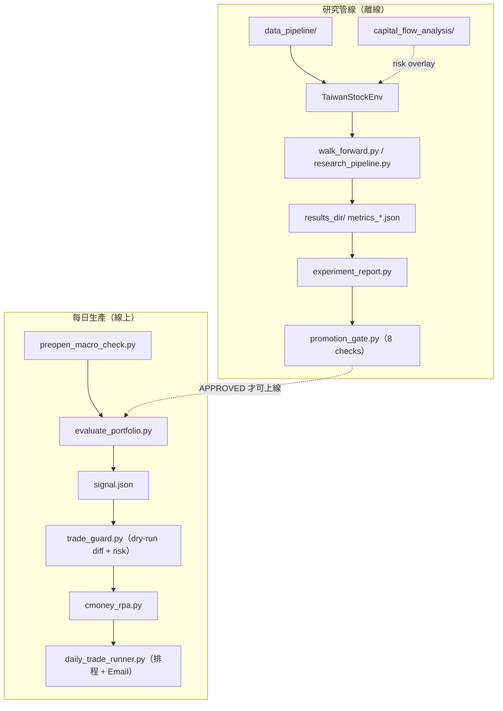

# Architecture

> 系統架構精簡版（從 `教學文件.md` 收斂，O4）。完整逐模組教學仍見 `教學文件.md`。

## 1. 定位

以強化學習（PPO / SAC）管理約 45 支台股科技/電子股投資組合的端到端系統，涵蓋
**離線研究**（訓練 → Walk-Forward 驗證 → Promotion Gate）與
**每日生產**（推論 → 風控 → CMoney 大富翁 RPA 下單）。

## 2. 兩條主線

## 3. 核心模組

| 層 | 模組 | 職責 |
|----|------|------|
| 環境 | `trading_env.py` | `TaiwanStockEnv`：MDP（state / action / reward） |
| 特徵 | `gnn_extractor.py` | 跨股 Self-Attention 特徵提取器（含 GRU temporal 變體） |
| 資料 | `data_pipeline/`、`data_loader.py` | 市場抓取、技術指標、多股 enrichment |
| 宏觀 | `capital_flow_analysis/` | 隔夜/宏觀特徵 + 盤前風控（risk overlay） |
| 訓練 | `train_portfolio.py` | PPO / SAC 建模與訓練 |
| 驗證 | `walk_forward.py`、`research_pipeline.py` | Walk-Forward 期間規劃、訓練/評估、metrics |
| 報告 | `experiment_report.py`、`p5_analysis.py` | 排名、ablation/stress/baseline |
| 關卡 | `promotion_gate.py` | 8 項品質 gate |
| 推論 | `evaluate_portfolio.py` | 產生 `signal.json` |
| 風控 | `trade_guard.py` | TTL / aid / risk limit / dry-run diff |
| 下單 | `cmoney_rpa.py` + `cmoney_client.py` / `signal_validator.py` / `rebalance_planner.py` | RPA 下單子系統 |
| 排程 | `daily_trade_runner.py` | 每日流程編排 + Email |
| 設定 | `settings.py`、`env_config.py` | 集中設定 + 實驗版本指紋 |

## 4. MDP 摘要

- **State**：每股 20 天市場特徵（flatten）+ 6 個帳戶特徵（現金比、累積報酬、回撤、持倉、單股報酬、持有天數）。
- **Action**：`Box(num_stocks(+1))` logits → softmax(temp=0.5) → top-k(5) → 權重（可選現金維度）。
- **Reward**：`0.4·報酬 + 0.3·Sortino + 0.3·超越基準 − 成本 − 換手 − 回撤懲罰 − regime 懲罰 + 防禦現金獎勵`，`clip(-1,1)`。reward 常數版本由 `env_config.ENV_CONFIG_VERSION` 標記（目前 `r4`）。
- 設計細節與 R4 調整見 [`ALGORITHM_REVIEW.md`](ALGORITHM_REVIEW.md)。

## 5. 設定與版本治理

- `settings.AppSettings`：`research` / `evaluation` / `live` / `paths` / `risk_limits` / `stress`，皆可由環境變數覆寫。
- `env_config.py`：reward/regime/topk 等訓練語意參數的版本（人工標籤）+ 8 字元 hash；metrics 帶版本，`experiment_report.py` 預設只讀當前版本（O1）。

## 6. 股票宇宙與 Macro 分離

`stock_universe.py`：約 45 支 TWSE/TPEX 科技股（`TICKERS_TECH_EXPANDED`）。

| 常數 | 用途 | 典型 tickers |
|------|------|--------------|
| `MACRO_TICKERS_RL` | RL 主線 observation | `^TWII`, `^IXIC`, `USDTWD=X` |
| `MACRO_TICKERS_FLOW` | Capital Flow 研究 | VIX, TNX, BTC, NQ/ES futures, JPY, DXY 等 |
| `MACRO_TICKERS` | 相容 alias → `MACRO_TICKERS_RL` | 新程式勿用 |

**規則**：extended macro 接入 RL 須明確命名（`overnight_feature_path`、`macro_mode=extended`），不可悄悄改 baseline。Flow macro 不自動進 RL 預設（O6/R5）。

## 7. 相關文件

- [`../專案總覽.md`](../專案總覽.md)：計畫打勾與全局決策
- [`README.md`](README.md)：文件索引
- [`RESEARCH_PLAYBOOK.md`](RESEARCH_PLAYBOOK.md)：分層訓練、Promotion Gate、研究 CLI
- [`SUPERVISED_LEARNING_PLAN.md`](SUPERVISED_LEARNING_PLAN.md)：SL 混合架構規格
- [`LIVE_OPS.md`](LIVE_OPS.md)：每日生產流程與風控
- [`ALGORITHM_REVIEW.md`](ALGORITHM_REVIEW.md)：演算法合理性評估
- [`../教學文件.md`](../教學文件.md)：完整逐模組教學
