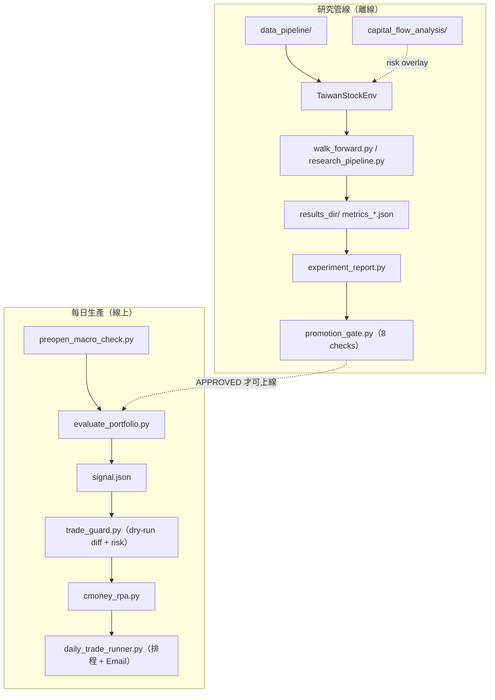

# Architecture

> 系統架構精簡版（從 `教學文件.md` 收斂，O4）。完整逐模組教學仍見 `教學文件.md`。

## 1. 定位

以強化學習（PPO / SAC）管理約 45 支台股科技/電子股投資組合的端到端系統，涵蓋
**離線研究**（訓練 → Walk-Forward 驗證 → Promotion Gate）與
**每日生產**（推論 → 風控 → CMoney 大富翁 RPA 下單）。

## 2. 兩條主線



## 3. 核心模組

| 層 | 模組 | 職責 |
|----|------|------|
| 環境 | `trading_env.py` | `TaiwanStockEnv`：MDP（state / action / reward） |
| 特徵 | `gnn_extractor.py` | 跨股 Self-Attention 特徵提取器（含 GRU temporal 變體） |
| 資料 | `data_pipeline/`、`data_loader.py` | 市場抓取、技術指標、多股 enrichment |
| 宏觀 | `capital_flow_analysis/` | 隔夜/宏觀特徵 + 盤前風控（risk overlay） |
| 訓練 | `train_portfolio.py` | PPO / SAC 建模與訓練 |
| 驗證 | `walk_forward.py`、`research_pipeline.py` | Walk-Forward 期間規劃、訓練/評估、metrics |
| 報告 | `experiment_report.py`、`p5_analysis.py` | 排名、ablation/stress/baseline |
| 關卡 | `promotion_gate.py` | 8 項品質 gate |
| 推論 | `evaluate_portfolio.py` | 產生 `signal.json` |
| 風控 | `trade_guard.py` | TTL / aid / risk limit / dry-run diff |
| 下單 | `cmoney_rpa.py` + `cmoney_client.py` / `signal_validator.py` / `rebalance_planner.py` | RPA 下單子系統 |
| 排程 | `daily_trade_runner.py` | 每日流程編排 + Email |
| 設定 | `settings.py`、`env_config.py` | 集中設定 + 實驗版本指紋 |

## 4. MDP 摘要

- **State**：每股 20 天市場特徵（flatten）+ **9 個帳戶特徵**（現金比、累積報酬、回撤、持倉、單股報酬、持有天數、滾動 vol、滾動 Sortino proxy、當前回撤深度）（M1a 新增 3 項）。
- **Action**：`Box(num_stocks(+1))` logits → softmax(**temp=1.0**，M1d 修正) → top-k(5) → 權重（可選現金維度；M1c：top-k 內 entropy floor 5%）。
- **Reward**：`0.4·報酬 + 0.3·Sortino + 0.3·超越基準 − 成本 − 換手 − 回撤懲罰 − regime 懲罰 + 防禦現金獎勵`，`clip(-1,1)`。reward 常數版本由 `env_config.ENV_CONFIG_VERSION` 標記（目前 **`r5.1`**）。
- 設計細節與 R5 調整見 [`ALGORITHM_REVIEW.md`](ALGORITHM_REVIEW.md)；已知風險見 [`RISK_REGISTER.md`](RISK_REGISTER.md)。

## 5. 設定與版本治理

- `settings.AppSettings`：`research` / `evaluation` / `live` / `paths` / `risk_limits` / `stress`，皆可由環境變數覆寫。
- `env_config.py`：reward/regime/topk 等訓練語意參數的版本（人工標籤）+ 8 字元 hash；metrics 帶版本，`experiment_report.py` 預設只讀當前版本（O1）。

## 6. 股票宇宙與 Macro 分離

`stock_universe.py`：約 45 支 TWSE/TPEX 科技股（`TICKERS_TECH_EXPANDED`）。

| 常數 | 用途 | 典型 tickers |
|------|------|--------------|
| `MACRO_TICKERS_RL` | RL 主線 observation | `^TWII`, `^IXIC`, `USDTWD=X` |
| `MACRO_TICKERS_FLOW` | Capital Flow 研究 | VIX, TNX, BTC, NQ/ES futures, JPY, DXY 等 |
| `MACRO_TICKERS` | 相容 alias → `MACRO_TICKERS_RL` | 新程式勿用 |

**規則**：extended macro 接入 RL 須明確命名（`overnight_feature_path`、`macro_mode=extended`），不可悄悄改 baseline。Flow macro 不自動進 RL 預設（O6/R5）。

## 7. 相關文件

- [`../專案總覽.md`](../專案總覽.md)：計畫打勾與全局決策
- [`README.md`](README.md)：文件索引
- [`RESEARCH_PLAYBOOK.md`](RESEARCH_PLAYBOOK.md)：分層訓練、Promotion Gate、研究 CLI
- [`SUPERVISED_LEARNING_PLAN.md`](SUPERVISED_LEARNING_PLAN.md)：SL 混合架構規格
- [`LIVE_OPS.md`](LIVE_OPS.md)：每日生產流程與風控
- [`ALGORITHM_REVIEW.md`](ALGORITHM_REVIEW.md)：演算法合理性評估
- [`../教學文件.md`](../教學文件.md)：完整逐模組教學


# 監督式學習混合架構設計（方案 B）

> **狀態**：設計拍板（2026-06-09）
> **定位**：與 RL 主線並行的研究線；第一版以 `RuleBasedAllocator` 產出可過 Gate 的基準，第二版預留 `RLAllocator` 接口。
> **前提**：不動 `daily_trade_runner.py` 生產路徑；與 RL 共用 walk-forward 期間、`metrics_utils`、`promotion_gate`。

---

## 1. 動機

| 痛點（RL 現況） | SL 可補之處 |
|----------------|-------------|
| 訓練慢（GTX 1060 約 36–52 fps，單期 300K 約 2 小時；P7 後瓶頸在 GPU 更新非 env） | LightGBM 幾分鐘可訓、快速迭代 |
| MDD Gate 卡關（worst-case 38.71% > 35%） | Vol-target + 階梯斷路器**顯式**控回撤 |
| Reward 與 Gate 目標錯位、POMDP | 直接優化可解釋的截面 alpha 標籤 |
| overnight features ablation 傷 Sortino | SL 打分與 RL 配置解耦，宏觀走 risk overlay（O6） |

**核心思路**：SL 負責「選股 / 打分」（擅長），配置與風控由可插拔的 `PortfolioAllocator` 負責；未來 RL 只學「在 SL 分數與摩擦成本下微調權重與現金」。

---

## 2. 拍板組態（鎖定）

| 項目 | 決策 |
|------|------|
| 標籤 | **截面去均值 5 日超額報酬**（`Target_5d_Cross_Demean`）；備妥 **10d** 變體 |
| 模型 | Pooled **LightGBM Regressor**（45 檔 × 交易日為列，共用一模型） |
| 特徵 | 現有 `FeatureSchema`（~22 base + ~7 cross-asset），**不放股票 id one-hot** |
| 選股 | Top-5（對齊 RL `default_topk`） |
| 權重 | Top-5 內 **反波動率加權** |
| Vol-target | **18%** 年化目標波動（貼近台股科技股基線） |
| 回撤風控 | **階梯式雙層**：10% MDD → 總曝險上限 50%；15% MDD → 熔斷（曝險 0–10%） |
| 換手 | **5d 取向** + **換手遲滯帶寬**（見 §4） |
| 架構 | **方案 B**：`SignalGenerator` + `PortfolioAllocator` 抽象；第一版 `RuleBasedAllocator`，預留 `RLAllocator` |
| 驗證 | 同 4 期 walk-forward、同 `TaiwanStockEnv` 成本假設、同 `promotion_gate` |

---

## 3. 標籤與防洩漏

### 3.1 標籤定義

```text
raw_5d_return_i(t)   = log(P_i(t+5) / P_i(t+1))   # T+1 成交對齊
universe_median_5d(t)= median(raw_5d_return_j(t) for j in universe)
Target_5d_Cross_Demean_i(t) = raw_5d_return_i(t) - universe_median_5d(t)
```

- **截面去均值**：剔除市場同漲同跌，模型學「相對同儕 alpha」。
- **T+1 對齊**：t 日收盤決策 → t+1 成交 → 持有至 t+5，與 CMoney T+1 賣買節奏一致。
- **10d 變體**：同上，將 5 改為 10，用於更低換手對照實驗。

### 3.2 防洩漏規則

- 特徵在 t 僅用 ≤t 資訊（沿用 `data_pipeline` 既有正規化）。
- 訓練切分：**時間序列、不打亂**；每個 walk-forward period 僅用該期 `train_start`～`train_end` 訓練，在 `test_start`～`test_end` OOS 預測。
- 與 `evaluate_gap_model.py` 相同精神：`TimeSeriesSplit` / expanding window。

---

## 4. 換手遲滯帶寬（Turnover Hysteresis Band）

配合 **5d（備 10d）** 預測，避免分數微幅波動觸發無謂調倉，與 RL 低換手（~0.8% 日換手）對齊。

### 4.1 持倉延續（名單層）

- 新一期 Top-5 與舊持倉比對：
  - 若舊持倉仍在 **Top-10** 分數排名內 → **不強制平倉**，可保留至下一再平衡日。
  - 僅當跌出 Top-10 或新進名單需替換時，才納入賣出清單。

### 4.2 權重微調（權重層）

- 若 `|target_weight - current_weight| < 5%`（單檔）→ **略過該檔調倉**。
- 組合層可選：總換手低於門檻時整批延後（實作時在 `RuleBasedAllocator` 內參數化）。

### 4.3 預期效果

- 年化換手壓在與 RL 可比區間。
- 5d 訊號 + 遲滯 → 減少「雙巴效應」式頻繁停損式調倉。

---

## 5. 階梯式風控（MDD vs 報酬）

純科技股宇宙 Beta 偏高；過緊單一斷路器（如 13% 全熔斷）易在 normal volatility 下 Whipsaw。

| 層級 | 觸發條件 | 動作 |
|------|----------|------|
| 常態 | 滾動 MDD < 10% | Vol-target **18%** 調整總曝險；Max Exposure 100% |
| **黃燈** | 滾動 MDD ≥ **10%** | 防禦模式：Max Exposure **50%**，其餘現金 |
| **紅燈** | 滾動 MDD ≥ **15%** | 熔斷：曝險 **0–10%**（參數化，預設 10% 或全現金） |
| 恢復 | MDD 回落至黃燈以下 | 依階梯逐步恢復曝險上限（避免 V 型反彈瞬間滿倉） |

**Vol-target 18%**：允許科技股合理波動；疊加宏觀惡化（可選：讀 `preopen_macro_check` 或 VIX 特徵）時額外縮放。

**單股上限**：沿用 `RiskLimits.max_single_weight`（預設 35%）。

---

## 6. 模組化架構（方案 B）

```text
sl_pipeline/
  __init__.py
  labels.py              # Target_5d_Cross_Demean, 10d 變體
  signal_generator.py    # SignalGenerator：訓練/推論 LightGBM，產出每日分數矩陣
  allocator.py           # PortfolioAllocator (ABC)
  rule_based_allocator.py # RuleBasedAllocator：Top-K + inv-vol + vol-target + 階梯 MDD + 遲滯
  rl_allocator.py        # （第二階段）RLAllocator：包 trading_env / SB3
  backtest.py            # 日頻模擬：成本、換手、持倉狀態
  walk_forward_sl.py     # CLI：對齊 research_pipeline.PERIODS
```

### 6.1 `SignalGenerator`（模型端）

**輸入**：`FeatureSchema` 對齊的多股面板資料（與 `fetch_multi_asset_data` 同源）。

**輸出**：`scores[ticker][date] -> float`（預期 5d 截面超額報酬）。

**職責**：

- 按 walk-forward train 視窗 fit LightGBM。
- OOS 期逐日 predict（僅用當日及過去特徵）。
- 可選：輸出 SHAP / feature importance 報告（沿用 `scripts/shap_analysis.py` 精神）。

### 6.2 `PortfolioAllocator`（抽象介面）

```python
class PortfolioAllocator(ABC):
    def allocate(
        self,
        scores: dict[str, float],      # ticker -> alpha score
        vols: dict[str, float],         # 滾動波動（反波動率用）
        state: PortfolioState,          # 現持倉、現金、peak_nav, rolling_mdd
        market_context: MarketContext,  # 可選：VIX、macro guard level
    ) -> TargetPortfolio:              # target_weights, cash_weight
        ...
```

### 6.3 `RuleBasedAllocator`（第一版）

實作順序：

1. 分數排序 → Top-5 候選。
2. 套用 **§4 遲滯帶寬** 決定實際買賣名單。
3. Top-K 內 **反波動率加權**。
4. **Vol-target 18%** 縮放股票總權重。
5. 套用 **§5 階梯 MDD** 調整 Max Exposure / 現金。
6. 單股 cap 35%；輸出 `target_weights` + `cash_weight`。

### 6.4 `RLAllocator`（第二階段，預留）

- **觀測增強**：將 `SignalGenerator` 當日 45 檔分數（或 Top-N 分數 + rank）併入 `TaiwanStockEnv` observation，緩解 POMDP、縮小 RL 搜尋空間。
- **動作空間**：可縮為「Top-5 權重 logits + 現金」或「對 RuleBased 權重的 residual 微調」。
- **訓練**：沿用 `walk_forward.py` / `research_pipeline.py`；`env_config` 標記 `sl_features=v1` 與 RL 分開比較。

---

## 7. 評估與 Gate 對齊

### 7.1 成本與指標

- **交易成本**（與 `trading_env.py` 一致）：
  - 佣金 `0.001425`、賣出稅 `0.003`、滑價 `0.001`
- **指標**：`metrics_utils.calculate_metrics`（Sortino、MDD、換手、現金行為等）。
- **期間**：`research_pipeline.PERIODS`（2024H2 → 2026H1）。

### 7.2 Promotion Gate

- 產出 `results_dir/metrics_sl_rule_seed42.json`（或獨立命名空間，內含 `strategy=sl_rule`、`env_config` 標記）。
- 送入 `promotion_gate.run_promotion_gate`，與 SAC enabled 等 RL 候選**並列**。
- `experiment_report.py` 可擴充「SL Baseline」區塊（不與 RL variant 混排）。

### 7.3 成功標準（第一版）

| 指標 | 目標 |
|------|------|
| worst-case MDD | ≤ 35%（Gate 門檻） |
| Sortino | ≥ RL 最佳候選的 80% 或更高 |
| 換手 | 與 RL 同量級或更低 |
| 訓練時間 | 全矩陣 < 1 小時（相對 RL 數天） |

若 SL 基準在 MDD 達標而 Sortino 略遜 → 仍具備「風控基準線」價值；若 Sortino 亦勝 → 考慮縮減 RL 投入或走第二階段 RLAllocator。

---

## 8. 端到端流程

```text
1. 讀取 FeatureSchema + fetch_multi_asset_data（與 RL 同源）
2. labels.build_target_5d_cross_demean()
3. 對每個 walk-forward period：
     train SignalGenerator (LightGBM, time-ordered split)
     OOS predict → daily score panel
     RuleBasedAllocator → daily target_weights + cash
     backtest.simulate()  # T+1、成本、遲滯、階梯 MDD
4. persist_period_metrics → JSON（含 env_config / strategy tag）
5. experiment_report + promotion_gate
```

**CLI（規劃）**：

```bash
python -m sl_pipeline.walk_forward_sl --label 5d --allocator rule
python -m sl_pipeline.walk_forward_sl --label 10d --allocator rule   # 對照
# 第二階段
python walk_forward.py --sl-scores-path results_dir/sl_scores_5d.csv ...
```

---

## 9. 與現有專案元件對照

| 現有元件 | SL 線用法 |
|----------|-----------|
| `data_loader.fetch_multi_asset_data` | 特徵面板 |
| `data_pipeline.utils.FeatureSchema` | 維度校驗 |
| `research_pipeline.PERIODS` | 相同 OOS 視窗 |
| `metrics_utils.calculate_metrics` | 績效結算 |
| `promotion_gate` | 上線關卡 |
| `capital_flow_analysis` / `preopen_macro_check` | 可選 `MarketContext` 輸入 Allocator（O6 overlay） |
| `evaluate_gap_model.py` | LightGBM + 時序切分參考實作 |
| `trading_env.py` | 第二階段 RLAllocator 環境 |

---

## 10. 風險與不做事項

| 風險 | 緩解 |
|------|------|
| 5d 標籤在熊市失效 | 10d 變體 + 階梯 MDD；macro overlay |
| Pooled 模型過擬合 | 時序 CV、早停、特徵數克制 |
| 與 RL 成本假設不一致 | `backtest.py` 硬編碼與 `trading_env` 相同費率 |
| 程式變成義大利麵 | 強制 `SignalGenerator` / `Allocator` 邊界 |

**第一版不做**：

- 不改 `daily_trade_runner.py`、不替換 `evaluate_portfolio.py` 預設模型。
- 不把 overnight features 塞進 LightGBM 預設（對齊 R5/O6）。
- 不實作 `RLAllocator`（僅留接口與文件）。

---

## 11. 實施順序

> 打勾總表：[`專案總覽.md`](../專案總覽.md) §4.4

| 階段 | 內容 | 狀態 |
|------|------|------|
| **S1** | `sl_pipeline/` 骨架 + `labels` + `SignalGenerator` | ✅ |
| **S2** | `RuleBasedAllocator`（§4 遲滯 + §5 階梯）+ `backtest` | ✅ |
| **S3** | `walk_forward_sl` CLI + metrics JSON + Gate | ✅ 程式 |
| **S3 執行** | 全 4 期 OOS 實跑 | ✅（`metrics_sl_rule_h5_seed42.json` 產出；最新重跑 159.97% / 33.14% MDD） |
| **S4** | `experiment_report` SL 區塊 + RL 對照 | ✅ |
| **S5** | `RLAllocator` spike（`rl_spike` / `sl_features`） | ✅ spike |
| **S5 整合** | 分數併入 `TaiwanStockEnv` 正式訓練 | ✅ **完成**（`--sl-scores-dir` CLI + `build_sl_feature_arrays` + `trading_env.enable_sl_features`；5K 步短測驗證通過） |

---

## 12. 與 R 系列 / Phase 2 關係

| 項目 | 關係 |
|------|------|
| R6 RL 重訓 | 並行；SL 提供快速 MDD/Sortino 對照 |
| O6 risk overlay | SL Allocator 可讀 macro guard；不與 RL state 混用 overnight 預設 |
| Promotion Gate | SL 與 RL **同一套** Gate，證據可並排 |
| `ALGORITHM_REVIEW.md` | 中期建議「SL 打分 → RL 配置」→ 本文件為落地規格 |

---

## 相關文件

- `docs/RESEARCH_PLAYBOOK.md` — 分層訓練與 Gate
- `docs/ARCHITECTURE.md` — 系統總覽
- `ALGORITHM_REVIEW.md` — RL 合理性與 SL 建議
- `../專案總覽.md` — R6 smoke / 全局打勾
- `capital_flow_analysis/src/modeling/evaluate_gap_model.py` — LightGBM 參考


# Research Playbook

> **狀態**：v3 進行中 · **路線圖**：[`RESEARCH_STRATEGY_V3.md`](RESEARCH_STRATEGY_V3.md) · **入口**：[`../專案總覽.md`](../專案總覽.md)  
> **目的**：r5 改動 → O2 分層重訓（smoke/candidate/promotion）→ Gate。R7/R7b/R8/R9 已砍。

---

## 1. 分層訓練協議（O2）

砍掉無效的 full-matrix 重訓。每一層通過後才進下一層。

| Tier | timesteps | seeds | 通過條件 | 用途 |
|------|-----------|-------|----------|------|
| `smoke` | 300K | 1 | 能跑完、MDD 方向不惡化 | reward / env 改動初篩 |
| `candidate` | 300K | 2 | 2025H1 MDD 改善趨勢 | 確認是否值得 full run |
| `promotion` | 300K | 3 | 通過 Drawdown Gate | 僅最佳候選 + 1 對照 |

**規則**：

- Smoke 不過 → 不進 Candidate
- Candidate 方向錯 → 不進 Promotion
- Promotion 只跑最佳候選與 1 個對照，不跑全矩陣

`seeds` 取自 `--seeds`（預設 `42,43,44`）的前 N 個。tier 定義集中於 `settings.TIER_PRESETS`。

---

## 2. CLI 用法

```bash
# Smoke：改 reward 後健全性檢查（300K, seed 42）
python walk_forward.py --tier smoke --algo sac --cash-mode enabled

# Candidate：確認改善趨勢（300K, seed 42,43）
python walk_forward.py --tier candidate --algo sac --cash-mode enabled

# Promotion：最佳候選 + 對照（300K, seed 42,43,44）
python walk_forward.py --tier promotion --algo sac --cash-mode enabled
python walk_forward.py --tier promotion --algo ppo --cash-mode disabled

# 不帶 --tier 時沿用 walk_forward_timesteps 預設（300K）
python walk_forward.py --seeds 42,43,44
```

`--tier` 會覆寫 `--timesteps` 與 `--seeds`。也可用環境變數 `RESEARCH_TIER=smoke` 設預設。

### 預設候選集 vs 全矩陣（O3）

```bash
# 候選集（推薦）：只訓練 SAC enabled + PPO disabled（歷史前二），非全矩陣
python walk_forward.py --candidates --tier promotion

# 全矩陣（opt-in，昂貴）：PPO/SAC x cash on/off x seeds x 4 periods（~18M steps@300K x3）
python walk_forward.py --matrix --tier promotion
```

overnight features 為 opt-in（預設 base）。要產生 risk-overlay 對照才加 `--overnight-feature-path <csv>`。

---

## 3. 實驗版本治理（O1，依賴）

改 reward / regime / topk 等影響訓練語意的參數時：

1. 更新 `env_config.ENV_CONFIG_VERSION`（例如 `r4` → `r5`）
2. 依分層協議重訓必要組合
3. metrics JSON 自動帶 `env_config_version` / `env_config_hash`
4. `experiment_report.py` 預設 `--current-env-only`，只讀當前版本，不混用舊世代

```bash
python experiment_report.py                     # 只讀當前 env
python experiment_report.py --env-config-version r3   # R3/R4 對照
python experiment_report.py --include-all-env-configs # 全世代（不建議用於 Gate）
```

---

## 4. 完整研究迭代流程

```text
改 reward / env（bump ENV_CONFIG_VERSION）
  ↓
smoke（300K/1 seed）      ── 不過則回頭改參數
  ↓ 方向正確
candidate（300K/2 seeds） ── 趨勢錯則放棄此方向
  ↓ MDD 改善趨勢
promotion（300K/3 seeds，最佳候選 + 對照）

（已拍板：timesteps 全 tier 統一 300K，tier 僅差 seed 數）
  ↓
python experiment_report.py   （自動只讀當前 env）
  ↓
Promotion Gate（8 checks）
  ↓ APPROVED 才考慮上線
```

---

## 5. Promotion Gate（驗收標準）

最佳候選需同時滿足（門檻見 `settings.ResearchSettings`，可由環境變數覆寫）：

| Gate | 預設門檻 |
|------|----------|
| Sortino 穩定性 | ≥ 0.8（跨 ≥ 3 seeds） |
| Max Drawdown | worst-case ≤ 35% |
| Turnover | ≤ 0.10 |
| Cash behavior | cash-enabled 須有實際調整 |
| Baseline / Ablation / Stress / Period consistency | 見 `promotion_gate.py` |

目前狀態：`BLOCKED`，卡 Drawdown Gate（worst-case 38.71%）與 Ablation (Features)。詳見 [`../專案總覽.md`](../專案總覽.md) §5。

---

## 6. 測試與驗收

```bash
# O1 / O2 單元測試
python -m unittest tests.test_env_config tests.test_settings tests.test_experiment_report -v

# 全量回歸
python -m unittest discover -s tests -p "test_*.py"

# 報告（確認標頭含 env_config_version / hash）
python experiment_report.py
```

---

## 7. Risk Overlay 策略（O6 / R5 決策）

**決策**：RL 主線維持 base features；隔夜/宏觀特徵作為「風險疊加層」，不進預設 observation。

依據（ablation，見 [`../專案總覽.md`](../專案總覽.md) §5）：

| 指標 | With Features | Without Features |
|------|--------------:|-----------------:|
| Sortino | 0.88 | 2.20 |
| Total Return | 107.98% | 159.26% |
| Max Drawdown | 25.46% | 36.12% |
| Turnover | 0.45% | 3.15% |

overnight features 改善回撤與換手，但明顯犧牲 Sortino 與總報酬 → 只能視為**風險抑制訊號**，
不能當作提升 alpha 的預設輸入。

**落地方式**：

1. RL 訓練/評估預設 base features（`walk_forward.py --overnight-feature-path` 預設 None）。
2. 宏觀風險改由 overlay 承接：盤前 `preopen_macro_check.py`（WARN 減半 / CRITICAL 跳過買單）
   與 `trade_guard.py` 風險限額，而非塞進 state。
3. `experiment_report.py` 將 `with_features` 拆為獨立「Risk Overlay」表，**不進主排名、不作 promotion 候選**。
4. 要重新評估特徵時，以 opt-in 方式重訓：`walk_forward.py --overnight-feature-path <csv>`，
   產出 `*_with_features` metrics，於 overlay 區比較。

## 相關文件

- [`../專案總覽.md`](../專案總覽.md)：計畫打勾與 Gate 狀態
- [`ALGORITHM_REVIEW.md`](ALGORITHM_REVIEW.md)：算法合理性評估
- [`archive/重構計畫_Phase2.md`](archive/重構計畫_Phase2.md)：O1–O6 歷史實作細節（封存）
- [`../教學文件.md`](../教學文件.md)：系統架構與模組說明


