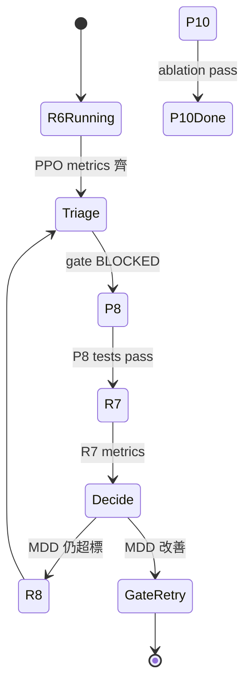

# CP 研究迴圈（Research Loop）— R6 後多 Agent 自動評估

> **狀態**：腳手架就緒（2026-06-11）· **啟用條件**：R6 promotion 跑完（PPO 3 seeds metrics 齊）
> **相關**：[`SAC_BUFFER_PLAN.md`](SAC_BUFFER_PLAN.md) · [`RESEARCH_PLAYBOOK.md`](RESEARCH_PLAYBOOK.md) · [`.research/research_state.json`](../.research/research_state.json)

---

## 0. 核心概念

**工作從「每次手動 prompt」變成「寫迴圈」**：你只定義遞迴目標與終止條件，系統每輪讀磁碟狀態 → 分類 → 派工 → 寫回 → 判定是否繼續。

```text
目標：RL 研究線取得可解釋的 Gate 進展（或證明下一桿子無效）
硬終止：Promotion Gate APPROVED（8/8）
軟終止：P8→R7→（R8/R9 視結果）排程完成 + decisions/ 有最終 memo
每輪禁止：改 walk_forward 進行中進程 · 中途改 R6 buffer · 一輪動多個變因
```

---

## 1. Automation（按時觸發、自行分類）

### 1.1 兩層觸發

| 層級 | 機制 | 用途 |
|------|------|------|
| **事件驅動** | `results_dir/metrics_*.json` 變更、`experiment_report.md` 更新、pytest 失敗 | R6 完成、R7 出結果 |
| **心跳驅動** | Cursor `/loop dynamic` 或 Automations cron | 長訓練監看、夜間 orchestrator |

分類**不靠 agent 猜**：`scripts/research_orchestrator.py` 讀 `.research/research_state.json` 的 `queue[]`（`id` / `status` / `blocked_by`）。

### 1.2 Orchestrator 一輪（R6 後啟用）

```powershell
# 乾跑：只印下一任務與建議 prompt（預設）
.\env\Scripts\python.exe scripts\research_orchestrator.py

# 執行允許的動作（pytest、experiment_report、開 worktree 指令等）
.\env\Scripts\python.exe scripts\research_orchestrator.py --execute
```

**嚴禁自動 `--execute` 跑 300K walk_forward**（GPU 單卡、需人確認）。訓練仍由人啟動或專用 Automation 模板觸發。

### 1.3 Cursor Automations（可選）

R6 完成後可建 Automation：

- **觸發**：`results_dir/metrics_ppo_disabled_wf_seed44.json` 出現（或每日定時）
- **動作**：跑 `experiment_report.py` → `research_orchestrator.py` → 若有 `pending` 則開 Agent 任務（P8 worktree）

Automations 的 MCP 僅能 prefilled **dashboard 已連線**的 server（見 `automate` skill）；本專案迴圈核心用 **Shell + gh**，不依賴 browser MCP。

**現階段**：`phase=post_r6` — P8 由 **Antigravity IDE**、P10 由 **Cursor** 平行 implement。

---

## 2b. 跨工具雙 Agent（Cursor + Antigravity IDE）

**不假設**第二個 agent 是 Cursor。通訊只靠 **Git + `.research/` 檔案**。

| 支柱 | 跨工具調整 |
|------|------------|
| **Automation** | orchestrator 讀 `handoffs/*.json` 解鎖 `cross_review`；外部工具無 orchestrator |
| **Worktree** | external → `../cp-p8-buffer`；Cursor → `../cp-p10-ppo` |
| **Skills** | Cursor 讀 `.cursor/skills/`；Antigravity 讀 worktree `AGENTS.md` + `GEMINI.md` |
| **MCP** | 外部工具自備（Cursor 仍 Shell + gh） |
| **外部記憶** | `handoffs/` + `reviews/` 為共用 mailbox |

```text
implement (平行)
  external: P8 on feat/p8-indexed-replay-buffer
  cursor:   P10 on feat/p10-ppo-vecenv
       ↓ handoffs/P8.json + P10.json
cross_review (互換)
  external → reviews/P10-reviewed-by-external.md
  cursor   → reviews/P8-reviewed-by-cursor.md
       ↓ 人類 merge
integrate → R7
```

**Antigravity 設定**：見 [`.research/EXTERNAL_AGENT_BRIEF.md`](../.research/EXTERNAL_AGENT_BRIEF.md) · 規則模板 [`.research/antigravity/AGENTS.md`](../.research/antigravity/AGENTS.md)

**Cursor agent**：implement P10 後讀 `.cursor/skills/cp-handoff/SKILL.md` 審查 P8。

---

## 2. Worktree（多 Agent 平行、互不干擾）

| Worktree 目錄 | 分支 | Agent 任務 | 互斥 |
|---------------|------|------------|------|
| `../cp-p8-buffer` | `feat/p8-indexed-replay-buffer` | P8 IndexedReplayBuffer | `train_portfolio.py` |
| `../cp-p10-ppo` | `feat/p10-ppo-vecenv` | P10 PPO 效率 ablation | 同上 PPO 區塊 |
| `../cp-docs` | `docs/research-loop` | 報告、ledger、decision memo | 只讀 metrics |

規則：

1. **一 worktree = 一 agent = 一分支**；合併前 `pytest` + `ruff`。
2. **GPU 訓練序列化**：`research_state.json` 的 `train_slot` 同一時間只有一個 `busy`。
3. P8 與 P10 **可平行寫碼**；R7 訓練須等 P8 merge。

建立 worktree 範例（orchestrator 乾跑也會印出）：

```powershell
git worktree add ..\cp-p8-buffer -b feat/p8-indexed-replay-buffer
git worktree add ..\cp-p10-ppo -b feat/p10-ppo-vecenv
```

---

## 3. Skills（專案知識外置）

Agent **每輪必讀**（專案級，`.cursor/skills/`）：

| Skill | 用途 |
|-------|------|
| `cp-research-loop` | 讀 state、排程、禁止項、orchestrator 協議 |
| `cp-promotion-gate` | Gate 8 項、worst-case MDD、current-env-only |
| `cp-sac-buffer` | P8/R7 實作與驗收（摘 `SAC_BUFFER_PLAN.md`） |
| `cp-ppo-efficiency` | P10 ablation A0–A3（摘 `SAC_BUFFER_PLAN.md` §4） |
| `cp-handoff` | Cursor ↔ 外部工具 handoff / cross-review |

人讀：`專案總覽.md` + `docs/*`；**外部 agent** 讀：`.research/EXTERNAL_AGENT_BRIEF.md`；Cursor 讀：**skill + `.research/`**。

---

## 4. Plugins / Connectors（MCP）

本迴圈**最小連接集**：

| 連接 | 用途 |
|------|------|
| **Shell** | `walk_forward`、`pytest`、`experiment_report`、orchestrator |
| **Git / `gh`** | PR、CI、issue（研究決策留痕） |
| **Filesystem** | `.research/`、`results_dir/` |

**暫不納入**：browser、Slack（除非你要手機推播）。研究迴圈 = 本地 metrics + git，不是外部 SaaS。

---

## 5. 外部記憶（磁碟，非 context）

```text
.research/
  research_state.json      # phase、gate、queue、agents、train_slot
  experiment_ledger.jsonl  # 每輪 append-only 審計
  EXTERNAL_AGENT_BRIEF.md  # Antigravity IDE 設定（P8）
  antigravity/AGENTS.md    # 複製到 cp-p8-buffer 根目錄
  antigravity/GEMINI.md    # Antigravity 專用規則
  handoffs/                # implement 完成 JSON（跨工具 mailbox）
  reviews/                 # cross_review markdown
  decisions/               # 人可讀 5 行決策 memo
  baselines/               # R6 freeze 後複製 metrics（R7 對照）
```

**每輪 agent 協議**：

1. `Read research_state.json`
2. 若 `phase == r6_running` 且 walk_forward 進程存在 → **只監看，不派新訓練**
3. 取 `queue` 中第一個 `status=pending` 且 `blocked_by` 全 `done`
4. 執行**單一**任務；訓練類寫入 `train_slot`
5. `Append experiment_ledger.jsonl` + 更新 state + 可選 `decisions/*.md`
6. **禁止**把整份 metrics JSON 塞進 prompt——只摘 5 個數 + 檔案路徑

---

## 6. 狀態機與排程（R6 後預填 queue）



| ID | 說明 | blocked_by |
|----|------|------------|
| `freeze_r6` | 複製 metrics → `baselines/`，更新 gate | R6 完成 |
| `P8` | IndexedReplayBuffer | `freeze_r6` | **external** |
| `P10` | PPO VecEnv ablation | `freeze_r6` | **cursor** |
| `cross_review` | 互換審查 | `P8` + `P10` handoffs | both |
| `R7` | SAC 重訓 | `P8` + `cross_review` | cursor |
| `R8` | SL-only obs 實驗 | `R7`（且 R7 MDD 仍 >35%） |
| `R9` | PER | `R7`（且 R7 MDD 仍 >35%） |

---

## 7. Orchestrator Prompt 模板（貼給 Claude / Cursor Agent）

```text
你是 CP 研究 orchestrator。遵守 .cursor/skills/cp-research-loop/SKILL.md。

1. 讀 .research/research_state.json 與 experiment_ledger.jsonl 最後 5 行
2. 若 phase=r6_running：只報告 walk_forward 進度，結束
3. 若 queue 空：跑 experiment_report.py，更新 gate，重填 queue
4. 取最高優先 pending（freeze_r6 → P8 ∥ P10 → R7 → R8/R9）
5. 寫碼任務在對應 worktree；跑 pytest；不跑 300K 除非 state.train_slot=free 且人類已確認
6. append ledger、更新 state、寫 decisions/ 若做分支決策
7. gate=APPROVED 或 queue 全 done → 終止並摘要
```

---

## 8. 啟用檢查清單

- [x] R6 metrics + 24 WF 模型齊
- [x] `experiment_report.py` → Gate BLOCKED（MDD 44.41%）
- [x] `baselines/` 凍結 · `phase=post_r6`
- [x] P8 handoff（Antigravity · `handoffs/P8.json`）
- [ ] P10 完整 ablation + `handoffs/P10.json`
- [ ] cross_review memos → merge → R7

**現階段**：P10 收尾 → cross_review → R7（需人確認 300K）。
