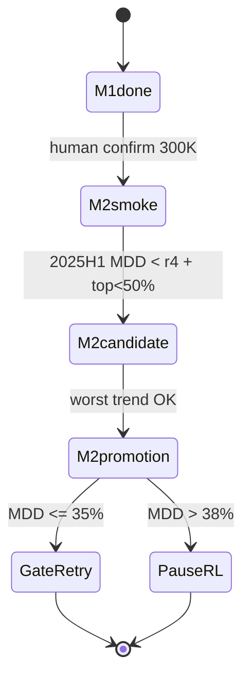

# CP 研究迴圈（Research Loop）— v3 RL Rebuild

> **狀態**：v3.1（2026-06-11）· **phase**=`rl_rebuild_v3`  
> **活躍計畫**：[`RESEARCH_STRATEGY_V3.md`](RESEARCH_STRATEGY_V3.md)  
> **相關**：[`RESEARCH_PLAYBOOK.md`](RESEARCH_PLAYBOOK.md) · [`.research/research_state.json`](../.research/research_state.json)

---

## 0. 核心概念

**北極星**：SAC enabled · 3 seeds · **worst-case MDD ≤ 35%**（Promotion Gate）

```text
目標：r5 結構改動（obs/reward/集中度）→ O2 分層 WF → Gate retry
硬終止：Gate APPROVED（8/8）或 RL 路徑停損（promotion MDD > 38% → SL hybrid）
已結束：P8/P10 implement · cross_review · R7/R7b/R8/R9 · SAC-R active line
每輪禁止：恢復已砍 SAC 工程 · 一輪多變因 · 未確認跑 300K WF
```

---

## 1. Automation

### 1.1 觸發

| 層級 | 機制 | 用途 |
|------|------|------|
| **事件驅動** | M2 metrics 產出、`experiment_report.md` 更新 | smoke/candidate/promotion 後 triage |
| **心跳驅動** | Cursor `/loop` 或 Automations | 監看 `train_slot`、orchestrator 乾跑 |

分類來源：`.research/research_state.json` → `queue[]`

### 1.2 Orchestrator

```powershell
.\env\Scripts\python.exe scripts\research_orchestrator.py          # 乾跑
.\env\Scripts\python.exe scripts\research_orchestrator.py --execute  # 安全步驟 only
```

**禁止**自動 `--execute` 跑 300K `walk_forward`。

### 1.3 現階段

`phase=rl_rebuild_v3` · `train_slot=free` · **M2-smoke 300K pending**（人類確認；短跑見 `.research/runs/`）

---

## 2. 跨工具 Agent（v3 審核）

P8/P10 implement **已完成**。外部 agent 現任務：

| 任務 | 文件 |
|------|------|
| v3 戰略 + 文件一致性審核 | [`.research/reviews/V3-STRATEGY-REVIEW-BRIEF.md`](../.research/reviews/V3-STRATEGY-REVIEW-BRIEF.md) |
| 外部 agent 設定 | [`.research/EXTERNAL_AGENT_BRIEF.md`](../.research/EXTERNAL_AGENT_BRIEF.md) |

輸出：`.research/reviews/V3-reviewed-by-<agent>.md`

---

## 3. Worktree

| Worktree | 分支 | 狀態 |
|----------|------|------|
| `cp`（main） | `main` | **活躍** — M1/M2 |
| `cp-p8-buffer` | `feat/p8-indexed-replay-buffer` | merged |
| `cp-p10-ppo` | `feat/p10-ppo-vecenv` | 封存 |
| `cp-sac-r` | `feat/sac-r-recurrent` | 封存 |

規則：v3 僅在 **main** 開發；`train_slot` 同時只有一個 `busy`。

---

## 4. Skills

| Skill | v3 用途 |
|-------|---------|
| `cp-research-loop` | 讀 state、M1/M2 queue |
| `cp-promotion-gate` | M2-promotion 後 Gate triage |
| `cp-sac-buffer` | P8 基礎設施參考 only（勿恢復 R7b/R8/R9） |
| `cp-ppo-efficiency` | 封存（P10 不合併） |
| `cp-handoff` | 歷史 P8/P10 協議 |

---

## 5. 外部記憶

```text
.research/
  research_state.json
  experiment_ledger.jsonl
  reviews/V3-STRATEGY-REVIEW-BRIEF.md   ← 外部審核入口
  handoffs/          # 歷史 P8/P10/SAC-R
  baselines/         # R6 凍結
  decisions/
```

**每輪協議**：

1. Read `research_state.json`
2. 取第一個 `pending` 且 `blocked_by` 全 satisfied
3. 單一任務；訓練寫入 `train_slot`
4. Append ledger；metrics 摘要 ≤ 5 數字

---

## 6. Queue（v3）



| ID | 說明 | 狀態 |
|----|------|------|
| P8 | IndexedReplayBuffer | done |
| M1a/M1b/M1d/M1c | obs · reward r5 · decode | **done** (r5.1) |
| M2-smoke | 300K seed42 | **pending**（人類確認） |
| M2-candidate / promotion | O2 tier WF | blocked |
| R7/R7b/R8/R9 | SAC 工程 | **cancelled** |
| SAC-R | Recurrent line | **frozen** |

---

## 7. Orchestrator Prompt 模板

```text
你是 CP 研究 orchestrator。遵守 .cursor/skills/cp-research-loop/SKILL.md。

1. 讀 .research/research_state.json 與 experiment_ledger.jsonl 最後 5 行
2. 活躍計畫：docs/RESEARCH_STRATEGY_V3.md（勿恢復 R7b/R8/R9/SAC-R）
3. 取 queue 第一個 pending 任務（應為 M2-smoke；需人類確認 train_slot）
4. M1 = code + pytest；M2 = walk_forward tier（需人確認 train_slot）
5. append ledger、更新 state
6. Gate APPROVED 或 RL 停損 → 終止並摘要
```

---

## 8. 啟用檢查清單

- [x] R6 metrics 凍結 · Gate BLOCKED（MDD 44.41%）
- [x] P8 merged · P10 ablation · cross_review
- [x] v3 戰略文件 · research_state v4
- [x] R7/R7b/R8/R9 已砍 · SAC-R frozen
- [x] v3 外部審核 → `V3-reviewed-by-*-r2.md`
- [x] M1a → M1b → M1d → M1c（r5.1）
- [ ] M2-smoke 300K（人類確認）
