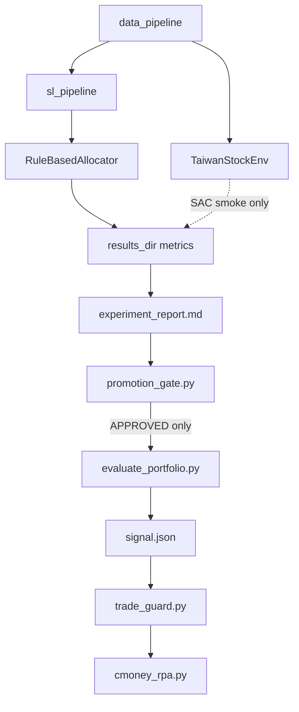

# CP 專案總覽

> Strategy snapshot: 2026-06-14
> Current research direction: SL-first, SAC research-only.

## 1. Current Decision

本專案目前不再把 SAC / PPO 強化學習模型作為上線主線。最新 SAC 結果顯示仍有 alpha 雛形，但存在三個不可忽視的問題：seed 間差異大、績效集中於少數期間、cash-enabled 版本容易退化成長期全現金。單一 seed 或單一期間的高報酬不得作為 live promotion 依據。

後續主線改為：

```text
SL signal -> rule allocator -> risk gate -> trade_guard -> CMoney RPA
```

SAC 保留為低成本研究線，只用於 reward/action/allocator ablation，不再預設完整 300K 多 seed promotion。

## 2. System Overview



## 3. Active Tracks

| Track | Status | Role |
|---|---|---|
| SL LightGBM h10 + rule allocator | Active mainline | h5 已淘汰；集中救 h10，優先把 MDD 從 38.1% 壓到 35% 以下，同時維持 turnover < 10%。 |
| SAC | Research-only | 5K/20K/50K smoke；必要時才 300K ablation；不得直接 promotion。 |
| PPO | Baseline / legacy | 僅作比較基準，不投入主要訓練資源。 |
| Capital flow / overnight features | Risk overlay | 先以 feature/guard 形式評估，不直接併入 live。 |
| Live trading | Blocked until gate | 必須由 promotion gate 通過後才可啟用。 |

## 4. Promotion Rule

任何模型要進 live，至少需要同時滿足：

- OOS Sortino 達標且跨 period 穩定。
- Max drawdown 在風險預算內，不只平均值漂亮。
- Turnover 經過 fee/tax/slippage 後仍可接受。
- Cash 行為不能是全現金坍縮，也不能以 0 報酬低回撤偽裝穩健。
- 弱期如 2024H2、2025H1 不能靠單一強期掩蓋。

## 5. Documentation Map

| File | Purpose |
|---|---|
| [DEVELOPER_GUIDE.md](DEVELOPER_GUIDE.md) | 目前工程與研究入口。 |
| [PRODUCTION_MANUAL.md](PRODUCTION_MANUAL.md) | Live 前檢查與風險守門。 |
| [ACCELERATION_PLAN.md](ACCELERATION_PLAN.md) | 訓練效率策略，已改為支援 SL-first。 |
| [archive/](archive/README.md) | 歷史計畫；已由 2026-06-14 SL-first 決策取代。 |
| [../experiment_report.md](../experiment_report.md) | 手動同步後的目前結果解讀；重跑 generator 可能覆蓋。 |
