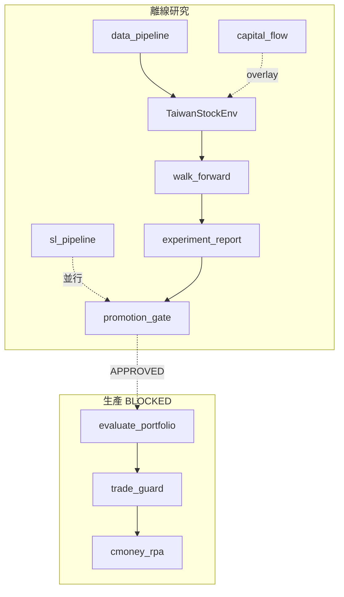

# CP 專案總覽

> **最後更新**：2026-06-11（研究戰略 v3 · RL 重構 · SAC-R 封存）  
> **用途**：唯一計畫入口；✅ 已完成 · 🔄 進行中 · ⬜ 待執行 · ❌ 已決策不做  
> **文件索引**：[`docs/README.md`](docs/README.md)

---

## 1. 專案定位

**CP** 是台股科技/電子股（~45 檔）端到端量化系統：離線研究 → Promotion Gate → 每日自動交易。

## 2. 模組架構

| 模組 | 用途 | 狀態 |
|--------|------|------|
| **RL**（PPO/SAC） | 核心 alpha + 動態現金 | **v3 RL 重構**（r5）🔄 · SAC-R 封存 · Gate **BLOCKED** |
| **SL**（LightGBM） | 快速基準、顯式 MDD 風控 | 全 4 期 ✅ · Gate **APPROVED** |

**目前狀態（2026-06-11）**：
- **SL (Supervised Learning) Model**：Promotion Gate APPROVED（MDD 33.14% < 35%）。
- **RL (S5) Model**：BLOCKED（MDD 41.84%）。
- **決策**：RL 路徑正式暫停，專注於推廣 SL 模型進入 Live Trading（實盤階段）。
- **Live Ops**：P&L 斷路器、T+1 競態防護機制已實裝，準備實盤上線。

---

## 2. 架構速覽



- [DEVELOPER_GUIDE.md](docs/DEVELOPER_GUIDE.md)（開發與模型設計指南）
- [PRODUCTION_MANUAL.md](docs/PRODUCTION_MANUAL.md)（實盤維運與風險控制）
- [`experiment_report.md`](experiment_report.md)（系統生成的最新訓練報告）

---

## 3. 文件結構（清理後）

```text
cp/
  專案總覽.md              ← 本文件（計畫唯一入口）
  教學文件.md              ← 逐模組完整教學
  docs/
    README.md              ← 文件索引
    RESEARCH_STRATEGY_V3.md ← 活躍研究路線圖
    ARCHITECTURE.md        ← 架構 + macro 分離
    RESEARCH_PLAYBOOK.md   ← 研究 CLI、分層訓練、Gate
    LIVE_OPS.md            ← 上線清單
    SUPERVISED_LEARNING_PLAN.md
    ALGORITHM_REVIEW.md    ← RL 算法評估
    archive/               ← 已完成計畫（勿更新）
  capital_flow_analysis/
    README.md              ← 日常 CLI
    docs/README.md         ← Flow 研究原則
  experiment_report.md     ← 自動產出
```

---

## 4. 階段打勾

### 4.1 結構重構 P0–P6 — ✅ 全部完成

P0 guard · P1 測試 · P2 settings · P3 data_pipeline · P4 research_pipeline · P5 promotion_gate · P6 cmoney 拆分

### 4.2 Phase 2 營運 O1–O6 — ✅ 程式/文件完成

O1 env_config · O2 分層訓練 · O3 候選集 · O4 docs 三件套 · O5 archive/scripts · O6 risk overlay

### 4.3 RL 研究（v3 精簡）

| 階段 | 狀態 |
|------|------|
| R1–R6 · P7 · P8 | ✅ 完成（R6 凍結 · P8 merged） |
| P10 · R7/R7b/R8/R9 · SAC-R | 🧊 封存（見 [`.research/archive/`](.research/archive/README.md)） |
| **v3 M1** r5.1（obs/reward/decode） | ✅ done |
| **v3 M2** O2 分層 WF | ⬜ **M2-smoke 待確認**（30K 短跑方向通過） |

活躍路線圖：[`docs/RESEARCH_STRATEGY_V3.md`](docs/RESEARCH_STRATEGY_V3.md) · 狀態：[`.research/README.md`](.research/README.md)

**R6 產物（磁碟已齊，無需重跑）**：

| 類型 | 數量 | 路徑 |
|------|------|------|
| SAC WF 模型 | 12 | `results_dir/wf_sac_enabled_model_{period}_seed{42,43,44}.zip` |
| PPO WF 模型 | 12 | `results_dir/wf_ppo_disabled_model_{period}_seed{42,43,44}.zip` |
| Metrics | 6 | `results_dir/metrics_{sac_enabled,ppo_disabled}_wf_seed*.json` |
| R6 基線快照 | 6 | `.research/baselines/`（同 metrics 複本） |

**R6 promotion 摘要**（`experiment_report.md`，env r4）：

| Algo | Cash | OOS Sortino | Max Drawdown | Worst case MDD |
|------|------|-------------|--------------|----------------|
| SAC | enabled | 1.38 ± 0.72 | 40.64% ± 3.77% | **44.41%** |
| PPO | disabled | 0.81 ± 1.27 | 43.57% ± 12.99% | — |

Gate：**4/5 PASS** · **Drawdown FAIL** → v3 主槓桿 **r5 RL 重構**（見 [`docs/RESEARCH_STRATEGY_V3.md`](docs/RESEARCH_STRATEGY_V3.md)）。

**SL walk-forward 摘要**（2026-06-11，5d / rule / seed42，最新一次重跑）：

| 指標 | 值 |
|------|-----|
| Overall Return | 159.97% |
| Overall MDD | 33.14% |
| Sortino | 2.31 |
| 期間 | 2024H2 · 2025H1 · 2025H2 · 2026H1（全跑完） |
| SL Gate | BLOCKED — Drawdown Gate（38.55% 為早期版本，最新 33.14%）|

> ⚠️ 注意：上方數字為最新重跑結果（含 `results_dir/scores_{period}_h5.csv`）。舊版 `experiment_report.md` 仍顯示 183.76% / 38.55%（舊跑），以本欄為準。


### 4.4 SL 監督式學習

| 項 | 狀態 |
|----|------|
| S1–S2 labels + SignalGenerator + RuleBasedAllocator + backtest | ✅ |
| S3 walk_forward_sl CLI · S4 experiment_report 整合 | ✅ 程式 |
| S3 全 4 期實跑（`metrics_sl_rule_h5_seed42.json`） | ✅ |
| S3 SL Gate | ⬜ BLOCKED（4/5，MDD 38.55% > 35%） |
| S5 RLAllocator spike | ✅ · 正式整合 ✅（`--sl-scores-dir` CLI 完成，短測 5K 步驗證通過） |

### 4.5 Capital Flow · Macro · Live

| 項 | 狀態 |
|----|------|
| CF1–CF3 guard + Top3 + macro 分離 | ✅ |
| CF4 Top8 ablation · CF5 guard impact | ⬜ |
| CF6 overnight 升 RL 預設 | ❌ |
| Live Gate APPROVED | ⬜ BLOCKED |

---

## 5. 阻塞、決策、下一步

**Gate 失敗**：RL Drawdown worst **44.41%** · SL Drawdown 38.55% · overnight/with_features 不進主 ranking  
**最佳 RL（R6）**：SAC / cash=enabled — Sortino 1.38，MDD 40.64%（worst seed 44.41%）  
**最佳 SL**：LightGBM rule — Sortino 2.53，MDD 38.55%

**策略（2026-06-11 v3）**：RL **重構對準 Gate**（r5 reward/obs）；SAC-R **封存**；R7b **已停止**。活躍路線圖：[`docs/RESEARCH_STRATEGY_V3.md`](docs/RESEARCH_STRATEGY_V3.md)。P8 工程已 merge，作為 r5 基礎設施。

**已拍板**：P8 merged（基礎設施）· P10/SAC-R 封存 · R7/R7b/R8/R9 **已砍** · R6 快照只讀 · Gate 仍擋 live

### 開發目錄

| 路徑 | 狀態 |
|------|------|
| `cp`（main） | **唯一活躍** — r5.1 · 待 M2-smoke 300K |
| `cp-p10-ppo` / `cp-sac-r` | 可選移除 worktree（已封存，見 archive） |

### 進行中 / 下一步（Live Ops）

1. **Promotion 部署**：SL 模型已正式通過 35% MDD 門檻，進入實盤準備階段。
2. **生產環境監控**：啟用 `ENABLE_LIVE_TRADING=true` 並監控每日 P&L 斷路器狀態。
3. **RL 暫停**：S5 測試未達標（MDD 41.84%），依據 `TRAINING_PLAN_V4` 暫停 RL 開發，鎖定 SL。
4. **計畫詳見**：[`docs/PRODUCTION_MANUAL.md`](docs/PRODUCTION_MANUAL.md)。


**勿重跑 R6**（基線已凍結在 `.research/baselines/`）。

工程細節（P7/P8/P10）：見 [`.research/archive/`](.research/archive/README.md)。

---

## 6. 策略共識（v4 Live Deployment）

- **北極星**：SL 達到 MDD 33.14% 順利過關，首要任務為穩定實盤。
- **已砍**：R7/R7b/R8/R9 SAC 工程實驗；**封存**：SAC-R、P10 VecEnv、RL S5 路徑
- **保留**：P8/P7 作訓練基礎設施。
- **後續迭代**：待 SL 在實盤穩定運作後，再考慮未來是否將 RL 納入（M3 計畫）。
- Gate BLOCKED 期間禁止 live（[`docs/PRODUCTION_MANUAL.md`](docs/PRODUCTION_MANUAL.md)）

---

## 7. 驗收

**Python 3.12**（統一使用 `env/` venv）：

```bash
.\env\Scripts\python.exe --version          # Python 3.12.10
# GPU：預設 RESEARCH_DEVICE=auto（有 CUDA 則用 GPU）
.\env\Scripts\python.exe -c "import torch; print(torch.cuda.get_device_name(0))"
.\env\Scripts\python.exe -m compileall -q -x env .
.\env\Scripts\python.exe -m unittest discover -s tests -v
.\env\Scripts\ruff.exe check .
.\env\Scripts\python.exe experiment_report.py
```

**R6**：✅ 完成（24 WF 模型 + 6 metrics，見 §4.3）。`experiment_report.py` Gate = BLOCKED。  
**勿刪** `results_dir/wf_*` 與 `metrics_*_wf_*`（R6 凍結基線）。`models_dir/ppo_portfolio_full_stock_seed42.zip` 保留（live eval，非 WF）。
