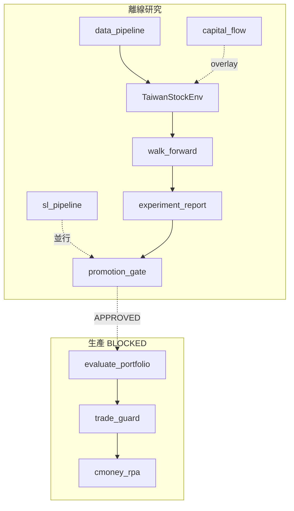

# CP 專案總覽

> **最後更新**：2026-06-11（R6 ✅ · P8 handoff · P10 進行中）  
> **用途**：唯一計畫入口；✅ 已完成 · 🔄 進行中 · ⬜ 待執行 · ❌ 已決策不做  
> **文件索引**：[`docs/README.md`](docs/README.md)

---

## 1. 專案定位

**CP** 是台股科技/電子股（~45 檔）端到端量化系統：離線研究 → Promotion Gate → 每日自動交易。

| 研究線 | 角色 | 狀態 |
|--------|------|------|
| **RL**（PPO/SAC） | 核心 alpha + 動態現金 | R6 ✅ · Gate **BLOCKED** · P8/P10 → R7 |
| **SL**（LightGBM） | 快速基準、顯式 MDD 風控 | 全 4 期 ✅ · Gate BLOCKED |
| **Capital Flow** | 盤前 guard + overnight 研究 | 輔助層 ✅ |

**全局**：Promotion Gate **BLOCKED** — RL worst MDD **44.41%**（SAC enabled）> 35%；不可上線。

---

## 2. 架構速覽



詳見 [`docs/ARCHITECTURE.md`](docs/ARCHITECTURE.md) · 逐模組 [`教學文件.md`](教學文件.md)

---

## 3. 文件結構（清理後）

```text
cp/
  專案總覽.md              ← 本文件（計畫唯一入口）
  教學文件.md              ← 逐模組完整教學
  docs/
    README.md              ← 文件索引
    ARCHITECTURE.md        ← 架構 + macro 分離
    RESEARCH_PLAYBOOK.md   ← 研究 CLI、分層訓練、Gate
    LIVE_OPS.md            ← 上線清單
    SUPERVISED_LEARNING_PLAN.md
    ALGORITHM_REVIEW.md    ← RL 算法評估
    archive/               ← 已完成計畫（勿更新）
  capital_flow_analysis/
    README.md              ← 日常 CLI
    docs/README.md         ← Flow 研究原則
  experiment_report.md     ← 自動產出
```

---

## 4. 階段打勾

### 4.1 結構重構 P0–P6 — ✅ 全部完成

P0 guard · P1 測試 · P2 settings · P3 data_pipeline · P4 research_pipeline · P5 promotion_gate · P6 cmoney 拆分

### 4.2 Phase 2 營運 O1–O6 — ✅ 程式/文件完成

O1 env_config · O2 分層訓練 · O3 候選集 · O4 docs 三件套 · O5 archive/scripts · O6 risk overlay

### 4.3 R 系列 RL 研究

| 項 | 狀態 |
|----|------|
| N1 300K×3 主矩陣 · N5 with_features 補訓 | ✅ |
| R1–R3 variant 分組、MDD 確認超標 | ✅ |
| R4 reward 調整（env r4） | ✅ 程式 |
| R5 overnight 不進 RL 預設 | ✅ |
| R6 smoke（MDD 32.84% 方向正） | ✅ |
| **P7 env 效能優化**（trading_env Pandas → NumPy，25x） | ✅ 2026-06-10 |
| **R6 promotion**（300K × SAC enabled + PPO disabled × 3 seeds） | ✅ 2026-06-11 |
| **P8 IndexedReplayBuffer**（Antigravity · `feat/p8-indexed-replay-buffer`） | 🔄 handoff 已交 · 待 Cursor review + merge |
| **P10 PPO 效率**（Cursor · `feat/p10-ppo-vecenv`） | 🔄 程式 + smoke ablation · 待 300K ablation |
| **R7 SAC 全歷史 buffer 重訓** | ⬜ P8 merge + cross_review 後 |
| R8 / R9 | ⬜ 視 R7 MDD |
| **Research Loop**（[`.research/`](../.research/) · [RESEARCH_LOOP.md](docs/RESEARCH_LOOP.md)） | ✅ post_r6 |

**R6 產物（磁碟已齊，無需重跑）**：

| 類型 | 數量 | 路徑 |
|------|------|------|
| SAC WF 模型 | 12 | `results_dir/wf_sac_enabled_model_{period}_seed{42,43,44}.zip` |
| PPO WF 模型 | 12 | `results_dir/wf_ppo_disabled_model_{period}_seed{42,43,44}.zip` |
| Metrics | 6 | `results_dir/metrics_{sac_enabled,ppo_disabled}_wf_seed*.json` |
| R6 基線快照 | 6 | `.research/baselines/`（同 metrics 複本） |

**R6 promotion 摘要**（`experiment_report.md`，env r4）：

| Algo | Cash | OOS Sortino | Max Drawdown | Worst case MDD |
|------|------|-------------|--------------|----------------|
| SAC | enabled | 1.38 ± 0.72 | 40.64% ± 3.77% | **44.41%** |
| PPO | disabled | 0.81 ± 1.27 | 43.57% ± 12.99% | — |

Gate：**4/5 PASS** · **Drawdown FAIL** → 主槓桿 P8→R7（buffer 2,805 → 全歷史）。

**SL walk-forward 摘要**（2026-06-09，5d / rule / seed42）：

| 指標 | 值 |
|------|-----|
| Overall Return | 183.76% |
| Overall MDD | 38.55% |
| Sortino | 2.53 |
| Avg Cash | 14.31% |
| Turnover | 9.65% |
| 期間 | 2024H2 · 2025H1 · 2025H2 · 2026H1（全跑完） |
| SL Gate | BLOCKED — Drawdown Gate |

**R6 smoke 摘要**（30K/1 seed，僅看方向）：overall MDD 32.84%，2025H1 熊市 30.80%，Avg Cash 13.45%。

### 4.4 SL 監督式學習

| 項 | 狀態 |
|----|------|
| S1–S2 labels + SignalGenerator + RuleBasedAllocator + backtest | ✅ |
| S3 walk_forward_sl CLI · S4 experiment_report 整合 | ✅ 程式 |
| S3 全 4 期實跑（`metrics_sl_rule_h5_seed42.json`） | ✅ |
| S3 SL Gate | ⬜ BLOCKED（4/5，MDD 38.55% > 35%） |
| S5 RLAllocator spike | ✅ · 正式整合 ⬜ |

### 4.5 Capital Flow · Macro · Live

| 項 | 狀態 |
|----|------|
| CF1–CF3 guard + Top3 + macro 分離 | ✅ |
| CF4 Top8 ablation · CF5 guard impact | ⬜ |
| CF6 overnight 升 RL 預設 | ❌ |
| Live Gate APPROVED | ⬜ BLOCKED |

---

## 5. 阻塞、決策、下一步

**Gate 失敗**：RL Drawdown worst **44.41%** · SL Drawdown 38.55% · overnight/with_features 不進主 ranking  
**最佳 RL（R6）**：SAC / cash=enabled — Sortino 1.38，MDD 40.64%（worst seed 44.41%）  
**最佳 SL**：LightGBM rule — Sortino 2.53，MDD 38.55%

**已拍板**：overnight → overlay only · timesteps 全 tier **300K** · 雙 agent（Antigravity P8 + Cursor P10）

### 平行 worktree 狀態

| Worktree | 分支 | 負責 | 狀態 |
|----------|------|------|------|
| `cp`（main） | `main` | R6 產物、orchestrator | R6 模型/metrics **已齊** |
| `cp-p8-buffer` | `feat/p8-indexed-replay-buffer` | Antigravity | commit `fe831c4` · [`.research/handoffs/P8.json`](.research/handoffs/P8.json) |
| `cp-p10-ppo` | `feat/p10-ppo-vecenv` | Cursor | 未 commit：`train_portfolio.py` VecEnv · smoke ablation **1.29× fps** |

### 下一步（依序）

1. **P10**：`cp-p10-ppo` 跑完整 ablation（`PPO_N_ENVS=2`）→ 寫 `handoffs/P10.json`
2. **cross_review**：Cursor 審 P8 · Antigravity 審 P10 → `.research/reviews/*.md`
3. **merge** P8 + P10 → **R7**（不帶 `SAC_BUFFER_RAM_GB=1`，唯一變因 = IndexedReplayBuffer）

```powershell
# P10 完整 ablation（worktree）
cd C:\Users\ggini\Desktop\cp-p10-ppo
$env:PPO_N_ENVS='2'
..\cp\env\Scripts\python.exe scripts\ppo_efficiency_ablation.py --period 2025H1 --seed 42
```

**勿重跑 R6**（除非改 env/reward）：24 個 WF 模型 + 6 份 metrics 已在 `results_dir/`。

### P7 — trading_env 效能優化（2026-06-10，✅）

依《也許可以考慮計算建議》第一優先項實施，對應 commit 前後以 45 檔 × 12 特徵基準測試：

| 項 | 改動 | 結果 |
|----|------|------|
| `_get_observation()` | 逐檔 `.iloc` 切片 → `__init__` 預堆疊 `[T, N, F]` float32 3D 陣列 + 向量化 account/SL 欄位 | 主要加速來源 |
| `step()` benchmark | 45 次 Pandas rolling `.sum()` → `_log_returns[t-20:t].sum(axis=0)` | 同上 |
| `step()` log_returns | 逐檔 `.iloc` 取值 → `_log_returns[t]`（float64，獎勵數學不變） | 同上 |
| SL 特徵 | 逐步 dict lookup + astype → 預堆疊 `[T, N, 3]`（缺檔/越界 = 0，語意不變） | 同上 |
| **吞吐量** | 134 → 3,363 steps/s | **25.1x** |

**等價性驗證**：舊版（git HEAD~）與新版 env 以相同 actions 跑完整 episode，三種模式（benchmark+cash / benchmark / margin_short）的 **obs 與 reward 逐位元一致（max diff = 0.0）**。介面（obs/action space 形狀與 dtype）不變，**既有已訓練模型可直接載入**。守護測試：`tests/test_env_numpy_equivalence.py`（6 項；全套件 168 tests 通過）。

**SAC replay buffer 上限調高（2026-06-10，✅ 程式 · R7 起生效）**：`train_portfolio.py` 的 RAM 上限 2GB → 4GB，並修正舊公式對 `optimize_memory_usage=True` 的重複計算（obs/next_obs 共用陣列，舊版多估一倍）。效果：buffer 2,805 → **11,223 transitions**（~2.7 → ~10.9 個 episode），實際佔用 ~4GB / 機器 16GB。上限改由環境變數 `SAC_BUFFER_RAM_GB` 控制（預設 4）；R6 續跑帶 `=1` 重現 2,805 維持 seed 一致（見上方 R6 區塊）。注意：若未來用 `--workers 3` 平行跑 SAC，RAM 需求為 3 × 4GB。此為過渡方案；根本解法（IndexedReplayBuffer，buffer → 300K 全歷史）已評估完成，見 [`docs/SAC_BUFFER_PLAN.md`](docs/SAC_BUFFER_PLAN.md)。

**尚未實施（優先序遞減）**：data_pipeline parquet 快取 ⬜ · **P10 SubprocVecEnv** 🔄（ablation 進行中，預設 n_envs=2）· deque ring buffer ❌ · Attention 複雜度 ❌

---

## 6. 策略共識

- **SL 作快速基準 + RL 作上限探索**，同一 Gate 並排，非二選一
- 結構重構已收斂；**R6 已凍結** → 專注 P8/P10 merge 與 **R7 重訓過 Gate**
- Gate BLOCKED 期間禁止 live（[`docs/LIVE_OPS.md`](docs/LIVE_OPS.md)）

---

## 7. 驗收

**Python 3.12**（統一使用 `env/` venv）：

```bash
.\env\Scripts\python.exe --version          # Python 3.12.10
# GPU：預設 RESEARCH_DEVICE=auto（有 CUDA 則用 GPU）
.\env\Scripts\python.exe -c "import torch; print(torch.cuda.get_device_name(0))"
.\env\Scripts\python.exe -m compileall -q -x env .
.\env\Scripts\python.exe -m unittest discover -s tests -v
.\env\Scripts\ruff.exe check .
.\env\Scripts\python.exe experiment_report.py
```

**R6**：✅ 完成（24 WF 模型 + 6 metrics，見 §4.3）。`experiment_report.py` Gate = BLOCKED。  
**R7 前勿刪** `results_dir/wf_*` 與 `metrics_*_wf_*`。`models_dir/ppo_portfolio_full_stock_seed42.zip` 保留（live eval，非 WF）。
