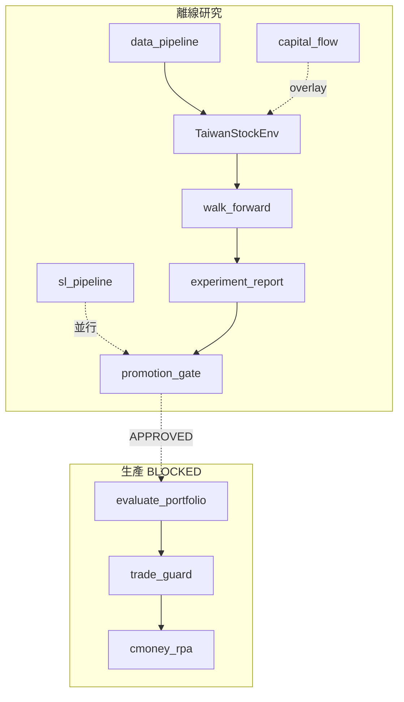

# CP 專案總覽

> **最後更新**：2026-06-09（Python 3.12 環境重建 · R6 執行中）  
> **用途**：唯一計畫入口；✅ 已完成 · ⬜ 待執行 · ❌ 已決策不做  
> **文件索引**：[`docs/README.md`](docs/README.md)

---

## 1. 專案定位

**CP** 是台股科技/電子股（~45 檔）端到端量化系統：離線研究 → Promotion Gate → 每日自動交易。

| 研究線 | 角色 | 狀態 |
|--------|------|------|
| **RL**（PPO/SAC） | 核心 alpha + 動態現金 | R6 重訓 ⬜ |
| **SL**（LightGBM） | 快速基準、顯式 MDD 風控 | 全 4 期 ✅ · Gate BLOCKED |
| **Capital Flow** | 盤前 guard + overnight 研究 | 輔助層 ✅ |

**全局**：Promotion Gate **BLOCKED**（6/8）— Drawdown worst 38.71% > 35%；不可上線。

---

## 2. 架構速覽



詳見 [`docs/ARCHITECTURE.md`](docs/ARCHITECTURE.md) · 逐模組 [`教學文件.md`](教學文件.md)

---

## 3. 文件結構（清理後）

```text
cp/
  專案總覽.md              ← 本文件（計畫唯一入口）
  教學文件.md              ← 逐模組完整教學
  docs/
    README.md              ← 文件索引
    ARCHITECTURE.md        ← 架構 + macro 分離
    RESEARCH_PLAYBOOK.md   ← 研究 CLI、分層訓練、Gate
    LIVE_OPS.md            ← 上線清單
    SUPERVISED_LEARNING_PLAN.md
    ALGORITHM_REVIEW.md    ← RL 算法評估
    archive/               ← 已完成計畫（勿更新）
  capital_flow_analysis/
    README.md              ← 日常 CLI
    docs/README.md         ← Flow 研究原則
  experiment_report.md     ← 自動產出
```

---

## 4. 階段打勾

### 4.1 結構重構 P0–P6 — ✅ 全部完成

P0 guard · P1 測試 · P2 settings · P3 data_pipeline · P4 research_pipeline · P5 promotion_gate · P6 cmoney 拆分

### 4.2 Phase 2 營運 O1–O6 — ✅ 程式/文件完成

O1 env_config · O2 分層訓練 · O3 候選集 · O4 docs 三件套 · O5 archive/scripts · O6 risk overlay

### 4.3 R 系列 RL 研究

| 項 | 狀態 |
|----|------|
| N1 300K×3 主矩陣 · N5 with_features 補訓 | ✅ |
| R1–R3 variant 分組、MDD 確認超標 | ✅ |
| R4 reward 調整（env r4） | ✅ 程式 |
| R5 overnight 不進 RL 預設 | ✅ |
| R6 smoke（MDD 32.84% 方向正） | ✅ |
| R6 candidate / promotion | ⬜ 待重跑（舊模型/metrics 已清除；全 tier 300K） |

**SL walk-forward 摘要**（2026-06-09，5d / rule / seed42）：

| 指標 | 值 |
|------|-----|
| Overall Return | 183.76% |
| Overall MDD | 38.55% |
| Sortino | 2.53 |
| Avg Cash | 14.31% |
| Turnover | 9.65% |
| 期間 | 2024H2 · 2025H1 · 2025H2 · 2026H1（全跑完） |
| SL Gate | BLOCKED — Drawdown Gate |

**R6 smoke 摘要**（30K/1 seed，僅看方向）：overall MDD 32.84%，2025H1 熊市 30.80%，Avg Cash 13.45%。

### 4.4 SL 監督式學習

| 項 | 狀態 |
|----|------|
| S1–S2 labels + SignalGenerator + RuleBasedAllocator + backtest | ✅ |
| S3 walk_forward_sl CLI · S4 experiment_report 整合 | ✅ 程式 |
| S3 全 4 期實跑（`metrics_sl_rule_h5_seed42.json`） | ✅ |
| S3 SL Gate | ⬜ BLOCKED（4/5，MDD 38.55% > 35%） |
| S5 RLAllocator spike | ✅ · 正式整合 ⬜ |

### 4.5 Capital Flow · Macro · Live

| 項 | 狀態 |
|----|------|
| CF1–CF3 guard + Top3 + macro 分離 | ✅ |
| CF4 Top8 ablation · CF5 guard impact | ⬜ |
| CF6 overnight 升 RL 預設 | ❌ |
| Live Gate APPROVED | ⬜ BLOCKED |

---

## 5. 阻塞、決策、下一步

**Gate 失敗**：RL Drawdown（38.71%）· Ablation（with_features 傷 Sortino）· **SL Drawdown（38.55%）**  
**最佳 RL**：SAC / cash=enabled / base — Sortino 2.32，MDD 36.09%  
**最佳 SL**：LightGBM + rule allocator — Sortino 2.53，MDD 38.55%

**已拍板**：overnight → overlay only · with_features 移出主 ranking · timesteps 全 tier **300K**

**R6 重跑**（2026-06-09 已清除 `results_dir` 舊 WF 模型 + legacy metrics）：

```bash
.\env\Scripts\python.exe walk_forward.py --candidates --tier promotion
.\env\Scripts\python.exe experiment_report.py
```

（`--tier candidate` 僅少 1 個 seed；可直接跑 promotion 取 3 seeds。）

---

## 6. 策略共識

- **SL 作快速基準 + RL 作上限探索**，同一 Gate 並排，非二選一
- 結構重構已收斂；專注 **R6 重訓 → 過 Gate**（SL 已跑完，MDD 仍超標）
- Gate BLOCKED 期間禁止 live（[`docs/LIVE_OPS.md`](docs/LIVE_OPS.md)）

---

## 7. 驗收

**Python 3.12**（統一使用 `env/` venv）：

```bash
.\env\Scripts\python.exe --version          # Python 3.12.10
.\env\Scripts\python.exe -m compileall -q -x env .
.\env\Scripts\python.exe -m unittest discover -s tests -v
.\env\Scripts\ruff.exe check .
.\env\Scripts\python.exe experiment_report.py
```

**R6 重跑前提（2026-06-09）**：已刪除 `results_dir/wf_{sac_enabled,ppo_disabled}_*` 模型與全部 legacy `metrics_*_wf_*.json`；`models_dir/ppo_portfolio_full_stock_seed42.zip` 保留（live eval 用，非 WF 產物）。

**重跑指令**：
```bash
.\env\Scripts\python.exe walk_forward.py --candidates --tier promotion
.\env\Scripts\python.exe experiment_report.py
```
